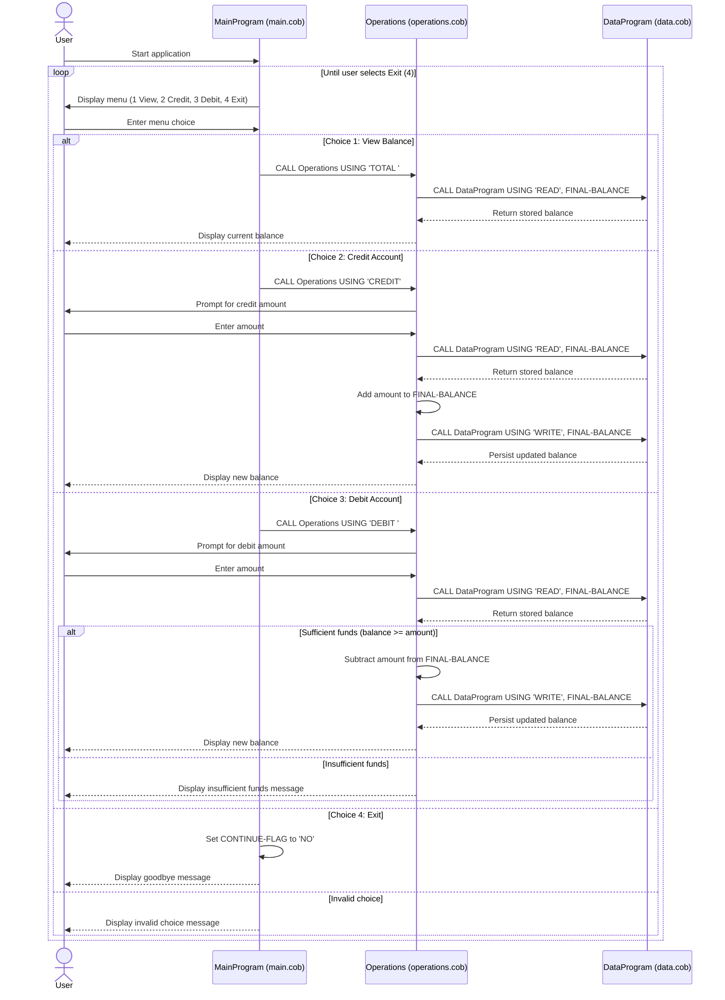

# COBOL Student Account Documentation

This document explains the legacy COBOL student account modules in this repository.

## Overview

The application is a menu-driven account management system for a student account balance. It supports:

- Viewing the current account balance
- Crediting (adding funds)
- Debiting (subtracting funds)

The programs are split into three files with clear responsibilities.

## File Purposes

### `src/cobol/main.cob` (`MainProgram`)

Purpose:
- Entry point and user interaction layer.
- Displays the account menu in a loop and routes user choices to business operations.

Key behavior:
- Accepts menu choices `1-4`.
- Calls `Operations` with operation codes:
  - `TOTAL ` for balance inquiry
  - `CREDIT` for adding funds
  - `DEBIT ` for removing funds
- Ends loop when user selects `4`.
- Shows validation message for invalid menu options.

### `src/cobol/operations.cob` (`Operations`)

Purpose:
- Business logic layer for student account transactions.
- Reads and updates account balance through `DataProgram`.

Key functions / flows:
- `TOTAL `:
  - Calls `DataProgram` with `READ`
  - Displays current balance
- `CREDIT`:
  - Prompts for credit amount
  - Reads current balance
  - Adds amount to balance
  - Writes updated balance
  - Displays new balance
- `DEBIT `:
  - Prompts for debit amount
  - Reads current balance
  - Validates funds are sufficient
  - Subtracts and writes updated balance when valid
  - Displays insufficient-funds message when invalid

### `src/cobol/data.cob` (`DataProgram`)

Purpose:
- Data access/storage abstraction for the account balance.
- Simulates persistence in working storage.

Key functions:
- `READ`: returns the stored balance
- `WRITE`: updates stored balance

Data details:
- Uses internal `STORAGE-BALANCE` with initial value `1000.00`.
- Receives operation and balance via linkage parameters.

## Student Account Business Rules

The following rules are implemented in the current COBOL logic:

1. The account starts with an initial balance of `1000.00`.
2. Debit transactions cannot overdraw the account.
3. When debit amount is greater than available balance, transaction is rejected.
4. Credit transactions always increase the balance by the entered amount.
5. Balance inquiries do not modify account state.
6. Only three operation codes are recognized by business logic: `TOTAL `, `CREDIT`, and `DEBIT `.
7. Menu input is restricted to options `1-4`; other values are treated as invalid.

## Notes for Modernization

- `DataProgram` currently stores balance in program working storage (in-memory style). For production modernization, this should be replaced by persistent storage (database/service).
- Validation can be expanded to reject non-numeric or negative transaction amounts.
- Student-specific extensions could include IDs, fee categories, scholarship credits, and payment history.

## Sequence Diagram (Data Flow)

